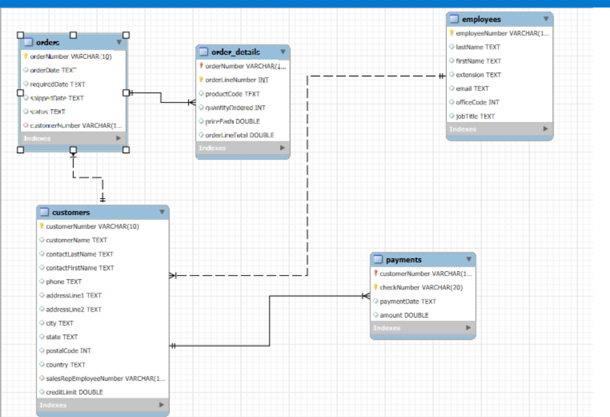
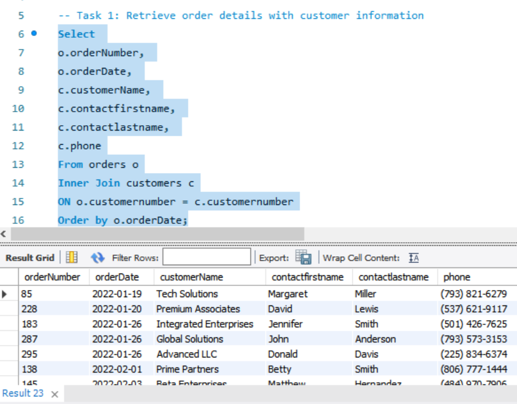
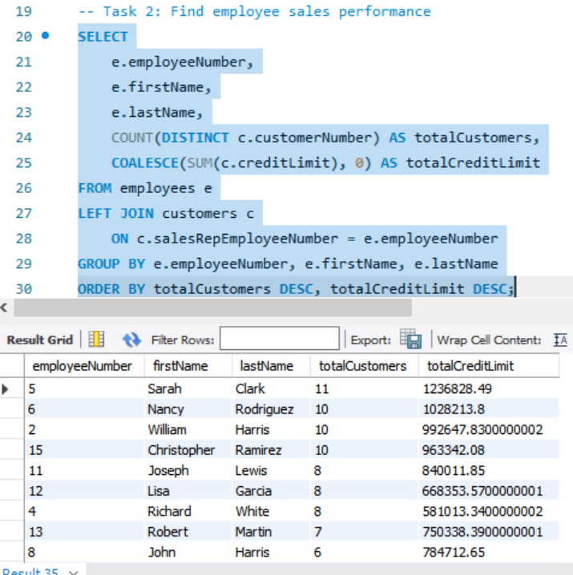
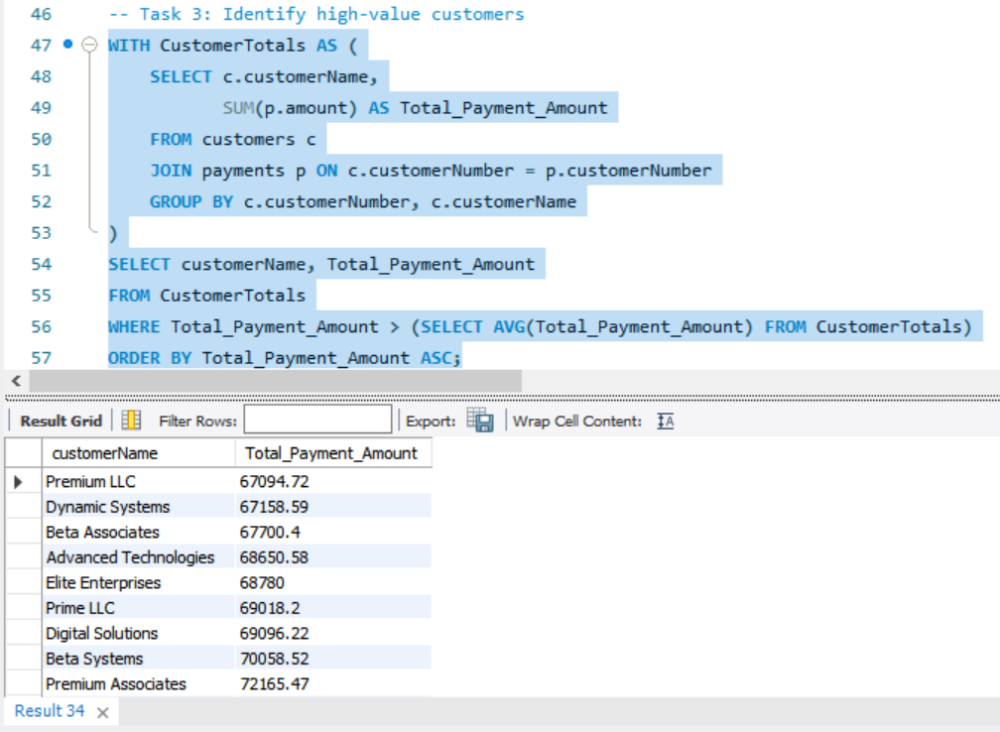
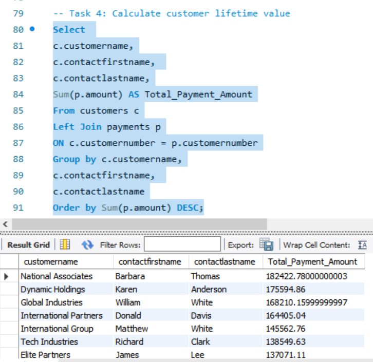
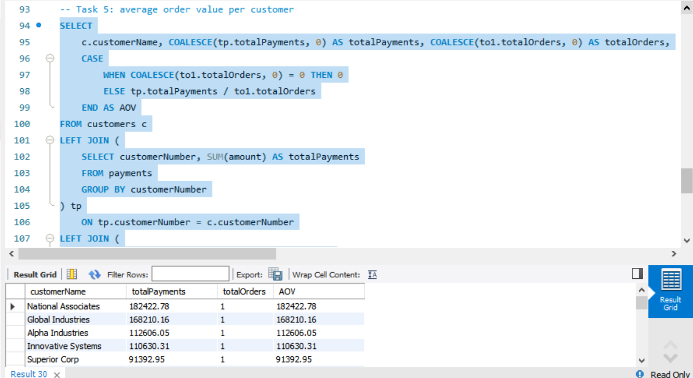
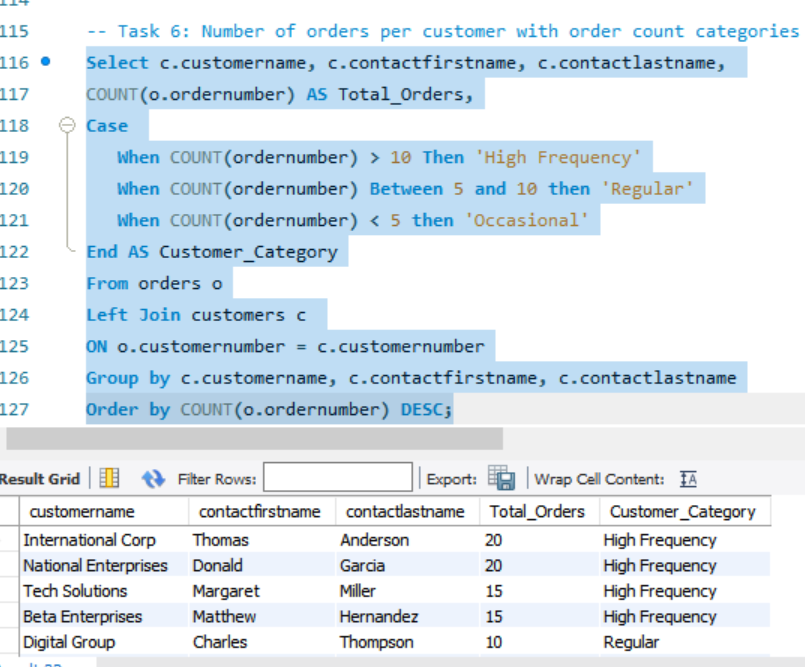

# Customer Intelligence & Lifetime Value Optimization Analysis
### Three-Year Customer Behavior & Sales Performance Study (2022–2024)

---

## Project Overview

Premium Systems International has been operating for over a decade, serving corporate clients worldwide. The company offers a comprehensive range of technology products and services, from individual software licenses to enterprise-wide digital transformation solutions.

The sales team is structured with Account Managers, Sales Representatives, and Sales Managers who are responsible for building relationships with clients, managing accounts, and driving revenue growth. Each customer is assigned a specific sales representative who serves as their primary point of contact.

Over the past three years (2022–2024), the company has processed hundreds of orders and thousands of payments.

The management team now wants to leverage this historical data to:

- Understand customer behavior patterns: Who are the most valuable customers? How frequently do they purchase?
- Evaluate sales team effectiveness: Which representatives are managing the most valuable accounts?
- Segment customers for targeted marketing: How can we categorize customers based on their purchasing habits?
- Optimize resource allocation: Where should we focus our customer service and sales efforts?
- Identify growth opportunities: Which customers have potential for upselling and cross-selling?

---

## Business Problem

The company needs to better understand its customer base and sales performance to make data-driven decisions.

Specifically, management wants to:

- **Improve Customer Relationship Management:** By having easy access to order details with customer contact information, sales representatives can quickly reach out to customers regarding their orders.
- **Evaluate Sales Team Performance:** Understanding which employees are managing the most customers and the highest credit limits helps in resource allocation, training needs identification, and performance-based incentives.
- **Identify High-Value Customers:** Finding customers who spend significantly more than average allows the company to develop targeted retention strategies and premium service offerings.
- **Calculate Customer Lifetime Value:** Knowing the total amount each customer has spent helps prioritize marketing efforts and customer service resources.
- **Analyze Order Patterns:** Understanding average order values and order frequency categories enables the company to segment customers effectively and develop tailored marketing campaigns.
- **Customer Segmentation:** Classifying customers based on order frequency (High, Regular, Occasional) allows for different engagement strategies for each segment.

---

## Methodology

### Database Schema & Entity Relationship Diagram

The analysis draws on five interconnected relational tables stored in a normalized database. The Entity Relationship Diagram (ERD) above maps the structural relationships between these tables, illustrating how data flows across customer, order, payment, and employee records.

The ERD reveals a hub-and-spoke architecture centered on the `customers` table, which acts as the primary connector across the dataset. Key structural relationships include:

- **`customers` → `orders` (One-to-Many):** A single customer can place multiple orders over time. This relationship is the backbone of order frequency analysis and CLV calculation.
- **`orders` → `order_details` (One-to-Many):** Each order is composed of one or more line items captured in the `order_details` table, recording the product code, quantity, unit price, and computed line total. This granularity enables product-level revenue analysis.
- **`customers` → `payments` (One-to-Many):** Payments are recorded independently from orders, linked directly to the customer. This design supports multi-payment scenarios and partial payment tracking.
- **`employees` → `customers` (One-to-Many):** Each customer is assigned to a single sales representative via the `salesRepEmployeeNumber` foreign key in the `customers` table. This relationship underpins sales team performance evaluation.

---

## About the Data

| File | Description |
|---|---|
| `customers.csv` | Customer demographic and contact information |
| `employees.csv` | Employee information |
| `orders.csv` | Order header information |
| `order_details.csv` | Line items for each order |
| `payments.csv` | Payment records from customers |

[View SQL Queries Here](Customer_LIfetime_Value/Customer_LIfetime_Value.sql) 

---

## SQL Queries and Analysis

### Task 1: Retrieve Order Details with Customer Information

**Objective:** List all orders along with the customer's name, contact person's full name, and phone number.

**Key Insights:**

- The dataset contains **300+ orders** spanning from January 2022 to December 2024, providing a comprehensive 3-year view of customer purchasing patterns.
- **Tech Solutions** (contact: Margaret Miller) placed the earliest order in the dataset on 2022-01-19, indicating they are a long-term customer.
- Multiple customers appear frequently throughout the timeline, showing strong repeat business; particularly **National Enterprises** (Donald Garcia) and **International Corp** (Thomas Anderson).
- The data shows consistent ordering activity across all three years with no significant gaps, indicating healthy ongoing customer engagement.

---

### Task 2: Find Employee Sales Performance

**Objective:** List all employees with the number of customers they manage and the total credit limit of their customers, sorted by total number of customers in descending order.

**Key Insights:**

- **Sarah Clark** is the top-performing sales representative, managing **11 customers** with the highest total credit limit of **$1.24 million**.
- Three employees (Nancy Rodriguez, William Harris, Christopher Ramirez) each manage **10 customers**, showing strong and balanced performance.
- The top 5 employees together manage **$5.06 million** in customer credit limits, representing the majority of the company's credit portfolio.
- **Jennifer Gonzalez** and **Robert Johnson** have the fewest customers (2 each), suggesting they may be newer hires or in different roles; potential for customer reassignment to balance workload.

---

### Task 3: Identify High-Value Customers

**Objective:** Find customers whose total payment amount is above the average total payment made by all customers, sorted in ascending order.

**Key Insights:**

- **47 customers** are classified as high-value, meaning they have spent more than the average customer total (estimated ~$65,000).
- **National Associates** is the top high-value customer with **$182,422** in total payments, followed by **Dynamic Holdings** ($175,595) and **Global Industries** ($168,210).
- The high-value segment shows a wide range from $67,000 to $182,000, indicating multiple tiers of valuable customers that could be targeted differently.
- Multiple entries with the same customer names (e.g., Premium LLC appears twice, Premium Systems appears twice) suggest possible duplicate records or multiple locations of the same brand worth investigating for data cleanup.
- The top 9 customers (**Tier 4**) each spent over **$130,000**, representing the "elite" segment that deserves executive-level attention and VIP treatment.

---

### Task 4: Calculate Customer Lifetime Value

**Objective:** Find the total amount spent by each customer, sorted in descending order.

**Key Insights:**

- **National Associates** is the most valuable customer with **$182,423** in lifetime payments, followed closely by **Dynamic Holdings** ($175,595) and **Global Industries** ($168,210).
- The **top 5 customers** alone have contributed over **$835,000** in total payments, highlighting the importance of maintaining strong relationships with these key accounts.
- Several customers show `NULL` values (no payments recorded), indicating they may have placed orders but haven't paid yet these should be followed up by the collections team.

---

### Task 5: Average Order Value per Customer

**Objective:** Find the average order value (AOV) per customer (Order Value = total payments / total orders).

**Key Insights:**

- **National Associates** has the highest average order value at **$182,423** from just one order, suggesting this was a large enterprise deal or annual contract.
- Customers with single, high-value orders over $100K including National Associates, Global Industries, Alpha Industries, and Innovative Systems appear to be project-based purchases.
- **International Partners** shows a healthy mix of high total payments ($164K) across 3 orders, giving them a strong AOV of **$54,802** ideal customer profile.
- Some customers have zero orders but have made payments (**Elite Enterprises**, **Global Associates**) this data inconsistency needs investigation.

---

### Task 6: Number of Orders per Customer with Order Count Categories

**Objective:** Retrieve the number of orders placed by each customer and classify them as:
- **High Frequency:** greater than 10 orders
- **Regular:** 5–10 orders
- **Occasional:** less than 5 orders

**Key Insights:**

- Only **4 customers (4%)** are classified as **High Frequency** (20–15 orders), but they generate **23% of all orders** these are the company's most loyal customers.
- **Regular customers** (5–10 orders) make up 12% of the customer base and contribute **30% of total orders** a stable and reliable segment.
- The vast majority (**84% of customers**) are **Occasional** buyers with fewer than 5 orders, representing a huge opportunity for re-engagement campaigns.
- **International Corp** and **National Enterprises** are the top customers with **20 orders each** approximately one order every 1.5 months over the 3-year period.

---

## Key Insights

After analyzing Premium Systems International's customer database across all six tasks, several critical patterns emerge that paint a clear picture of the business's health and opportunities.

**Customer Concentration:** The top 5 customers alone have contributed over **$835,000** in lifetime payments, with National Associates leading at $182,423. The high-value segment includes 47 customers who generate an estimated 85% of total revenue, while the remaining 53 customers contribute only 15%. This heavy concentration means losing even a few top customers would significantly impact the business.

**Order Frequency Patterns:** Only 4% of customers are classified as High Frequency with more than 10 orders, yet they generate 23% of all orders. Regular customers make up 12% of the base and contribute 30% of orders, while the overwhelming majority (84%) are Occasional buyers with fewer than 5 orders. This reveals a massive opportunity to convert occasional buyers into more frequent purchasers.

**Sales Team Performance:** Sarah Clark is the standout performer managing 11 customers with $1.24 million in credit limits. Four other employees each manage 10 customers, showing strong bench depth. However, the bottom two employees manage only 2 customers each, indicating uneven workload distribution across the sales team.

**Order Value Insights:** Customers fall into two distinct categories — those making single large transactions over $100,000 (like National Associates and Global Industries) suggesting project-based or annual contract purchases, and those with frequent smaller orders providing steady recurring revenue. International Partners represents an ideal customer profile with high total payments ($164,405) spread across multiple orders, giving them a healthy average order value of $54,802.

**Geographic Reach:** The customer base spans nine countries across North America, Europe, and Asia, demonstrating successful international expansion but also highlighting the need for region-specific strategies.

---

## Recommendations

Based on these insights, Premium Systems International should implement a tiered customer strategy.

1. The **top 9 elite customers** who have spent over $130,000 each should receive executive sponsorships, quarterly business reviews, and priority support to ensure their loyalty and identify expansion opportunities. The **38 mid-tier high-value customers** between $67,000 and $130,000 need dedicated account managers who can develop growth plans to move them up the value chain.

2. For the **84% of customers who are occasional buyers**, the company should launch targeted re-engagement campaigns with special offers and educational content about product benefits. These customers already know the company but need incentives to purchase more frequently.

3. The sales team structure should be optimized by promoting **Sarah Clark** to a player-coach role where she can mentor other representatives while retaining her top accounts. Workload should be rebalanced by reassigning some customers from overloaded representatives to those with lighter loads like Jennifer Gonzalez and Robert Johnson, who currently manage only 2 customers each.

4. Marketing efforts should be segmented by customer behavior:

- **High-frequency customers** should receive loyalty rewards and exclusive previews
- **Regular customers** need frequency incentives to become high-frequency
- **Occasional customers** require win-back campaigns and special introductory offers to reactivate their purchasing

The company must also invest in **data cleanup** to resolve duplicate customer records and investigate the inconsistencies between orders and payments. Clean data is essential for accurate reporting and decision-making.

---

## Limitation

**Missing Product Data:** While we know total order values, we lack detailed analysis of which specific products drive the most revenue and profit. Understanding product preferences by customer segment would enable more targeted cross-selling and inventory planning.

---

## Conclusion

Premium Systems International has a healthy customer base with strong revenue concentration among high-value accounts, a capable sales team led by top performers, and consistent order activity across three years. The business exhibits classic B2B characteristics where a small percentage of customers drive the majority of revenue, making retention of key accounts absolutely critical.

The path forward is clear: protect and grow the elite customer segment through executive attention, develop mid-tier customers into higher-value accounts through dedicated account management, and re-engage the massive occasional buyer segment through targeted marketing campaigns.

By implementing these strategies while balancing sales team workloads and cleaning up data inconsistencies, the company can build a more resilient and profitable customer portfolio.

The three years of transaction data provide a solid foundation for these initiatives, and with proper execution of these recommendations, Premium Systems International is well-positioned for sustained growth in 2025 and beyond.
